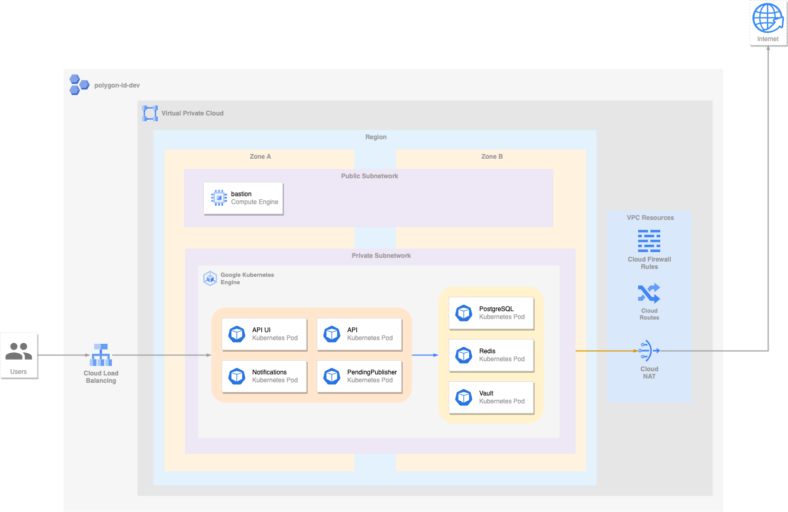

# Overview

Polygon ID issuer refers to the entity responsible for issuing unique identifiers, known as Polygon IDs, on the Polygon network. The Polygon network is a popular Layer 2 scaling solution for Ethereum, designed to improve scalability and reduce transaction costs.

To learn more about Polygon ID issuer, see [this](https://0xpolygonid.github.io/tutorials/issuer/issuer-overview).

## Architecture



# Installation

## Quick install with Google Cloud Marketplace

Get up and running with a few clicks! Install this RSMetrics app to a Google Kubernetes Engine cluster using Google Cloud Marketplace. Follow the [on-screen instructions](CONSOLE LINK OF PRODUCT AFTER IT GOES LIVE).

## Command line instructions

You can use [Google Cloud Shell](https://cloud.google.com/shell/) or a local
workstation to complete the following steps.

[](https://console.cloud.google.com/cloudshell/editor?cloudshell_git_repo=https://github.com/0xPolygonID/polygonid-issuer-marketplace&cloudshell_open_in_editor=README.md)

### Prerequisites

#### Set up command-line tools

Make sure you have these tools installed.

- [gcloud](https://cloud.google.com/sdk/gcloud/)
- [kubectl](https://kubernetes.io/docs/reference/kubectl/overview/)
- [docker](https://docs.docker.com/install/)
- [git](https://git-scm.com/book/en/v2/Getting-Started-Installing-Git)
- [helm](https://helm.sh/)

Configure `gcloud` as a Docker credential helper:

```shell
gcloud auth configure-docker
```

## Create a Google Kubernetes Engine cluster

If you have an existing GKE cluster you can use that otherwise you can create a new cluster from the command line.

```shell
export CLUSTER=YOUR_CLUSTER_NAME
export PROJECT=YOUR_PROJECT_ID
export REGION=YOUR_REGION
export ZONE=YOUR_ZONE

gcloud container clusters create $CLUSTER --region=$REGION --project $PROJECT
```

Configure `kubectl` to connect to the new cluster.

```shell
gcloud container clusters get-credentials $CLUSTER --region=$REGION --project $PROJECT
```

For zonal clusters, use --zone=ZONE instead of --region=REGION.

#### Clone this repo and the associated tools repo.

```shell
git clone https://github.com/0xPolygonID/polygonid-issuer-marketplace
cd polygonid-issuer-marketplace
```

#### Install the Application resource definition

An Application resource is a collection of individual Kubernetes components,
such as Services, Deployments, and so on, that you can manage as a group.

To set up your cluster to understand Application resources, run the following
command:

```shell
kubectl apply -f "https://raw.githubusercontent.com/GoogleCloudPlatform/marketplace-k8s-app-tools/master/crd/app-crd.yaml"
```

You need to run this command once.
The Application resource is defined by the
[Kubernetes SIG-apps](https://github.com/kubernetes/community/tree/master/sig-apps)
community. The source code can be found on
[github.com/kubernetes-sigs/application](https://github.com/kubernetes-sigs/application).

#### Configure the app with environment variables

Choose the instance name and namespace for the app:

```shell
export APP_INSTANCE_NAME=polygon-id-issuer  #Sample name for the application
export NAMESPACE=default #Namespace where you want to deploy the application
```

#### Set the values for the domains where you want to access to your application and privatekey,static IP.

```shell
export APP_DOMAIN=app.example.com  #Domain for the API UI
export UI_DOMAIN=ui.example.com    #Domain for the UI
export API_DOMAIN=api.example.com  #Domain for the API
export PRIVATE_KEY='YOUR PRIVATE KEY' #Private key of the wallet.
export STATIC_IP='YOUR STATIC IP' #Provide the Static IP if you have any otherwise leave this field.
export UI_PASSWORD='' # Password to login the UI
export ISSUER_NAME='YOUR DESIRED ISSUER NAME' # Provide the Issuer Name.
export MAINNET='true' #'False' if you want to use testnet.
export ETHEREUMURL='URL LINK OF ETHEREUM' #

```


#### Install the helm chart

```shell
helm install "$APP_INSTANCE_NAME" chart/polygon-id-issuer \
  --create-namespace --namespace "$NAMESPACE" \
  --set appdomain="$APP_DOMAIN" \
  --set uidomain="$UI_DOMAIN" \
  --set apidomain="$API_DOMAIN" \
  --set privatekey="$PRIVATE_KEY" \
  --set staticip="$STATIC_IP" \
  --set issuerName="$ISSUER_NAME" \
  --set uiPassword="$UI_PASSWORD" \
  --set mainnet="$MAINNET" \
  --set ethereumUrl="$ETHEREUMURL" 
```

Remove the `--set staticip="$STATIC_IP"` if you don't have static IP; ingress resource will automatically creates an IP address.

# Using the app

Retrieve IP address of both the Ingress using this command

```shell
kubectl get ingress app-ingress -o jsonpath='{.status.loadBalancer.ingress[0].ip}'
```

Add the DNS records for both the domains to the above IP.

---

### a New example

```bash
export APP_INSTANCE_NAME=polygon-id-issuer
export NAMESPACE=default
export APP_DOMAIN=app.issuernode.polygonid.me
export UI_DOMAIN=ui.issuernode.polygonid.me
export API_DOMAIN=api.issuernode.polygonid.me

export APP_INSTANCE_NAME=polygon-id-issuer
export NAMESPACE=default
export MAINNET=true
export UIPASSWORD=123456
export ISSUERNAME=My Issuer!
```

```bash
helm install "$APP_INSTANCE_NAME" chart/polygon-id-issuer \
  --create-namespace --namespace "$NAMESPACE" \
 --set appdomain="$APP_DOMAIN" \
  --set uidomain="$UI_DOMAIN" \
 --set apidomain="$API_DOMAIN" \
  --set privatekey="$PRIVATE_KEY" \
 --set mainnet="$MAINNET" \
  --set uiPassword="$UIPASSWORD" \
 --set issuerName="$ISSUERNAME"
```
